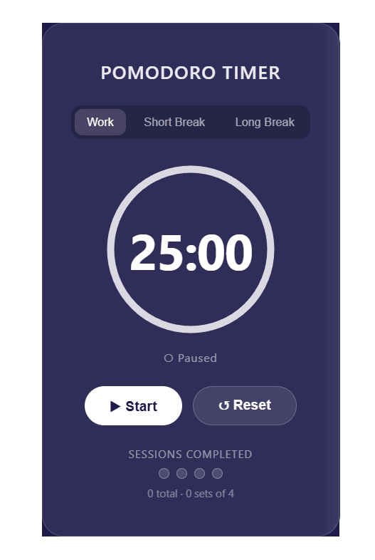

# Pomodoro Timer

A clean, focus-oriented Pomodoro timer built with React.
Stay productive with timed work sessions and breaks — background colour shifts with each mode.

## Live Demo
[View it live](https://ggencas2.github.io/pomodoro-timer)

## Screenshot


## Features
- Three modes: Work (25 min), Short Break (5 min), Long Break (15 min)
- Start, Pause, and Reset controls
- Background colour changes with each mode — purple for work, green for break, blue for long break
- Browser tab title updates live with the countdown — see the timer without switching tabs
- Session counter with 4-dot cycle indicator
- Tracks total sessions completed and full sets of 4
- Timer auto-stops when it reaches zero
- Work sessions automatically increment the session counter

## Tech stack
- React 18 — function components, useState, useEffect
- Vite — development server and build tool
- CSS3 — glassmorphism card, dynamic mode-based backgrounds, transitions

## What I learned building this
- `useEffect` with a cleanup function — `setInterval` for the tick,
  `clearInterval` in the return function to prevent memory leaks
- The stale closure problem — `setTimeLeft(prev => prev - 1)` instead of
  `setTimeLeft(timeLeft - 1)` because `timeLeft` inside `setInterval` is
  captured at render time and never updates
- Dependency arrays — `[isRunning, mode]` controls exactly when the effect
  re-runs, avoiding unnecessary interval restarts
- Multiple `useEffect` hooks in one component — one for the timer,
  one for updating `document.title`
- Early return inside `useEffect` — `if (!isRunning) return` exits
  the effect immediately when paused without setting up an interval
- Named + default exports from the same file — `MODES` as named export
  so App can access durations, `ModeSelector` as default export
- `padStart(2, '0')` for consistent two-digit time display
- Dynamic class names on the root element for mode-based theming

## Challenges
- Timer using a stale `timeLeft` value — discovered the stale closure problem
  and fixed it by using the functional form of `setTimeLeft`
- Preventing the interval from running when paused — solved with an early
  return guard at the top of the effect: `if (!isRunning) return`
- Keeping the session counter accurate across mode changes — `mode` added
  to the dependency array so the effect always has the current mode value

## How the Pomodoro technique works
1. Work for 25 minutes
2. Take a 5-minute short break
3. Repeat 4 times
4. Take a 15-minute long break
5. Start again

## Component structure
```
App.jsx                 ← owns all state, contains the useEffect timer
├── ModeSelector        ← work / short break / long break buttons
├── TimerDisplay        ← SVG circle, formatted countdown, running status
├── TimerControls       ← start, pause, reset buttons
└── SessionCounter      ← 4-dot cycle indicator and total count
```

## How to run it locally
1. Clone the repo:
   ```bash
   git clone https://github.com/ggencas2/pomodoro-timer.git
   ```
2. Install dependencies:
   ```bash
   cd pomodoro-timer
   npm install
   ```
3. Start the dev server:
   ```bash
   npm run dev
   ```
4. Open `http://localhost:5173`
